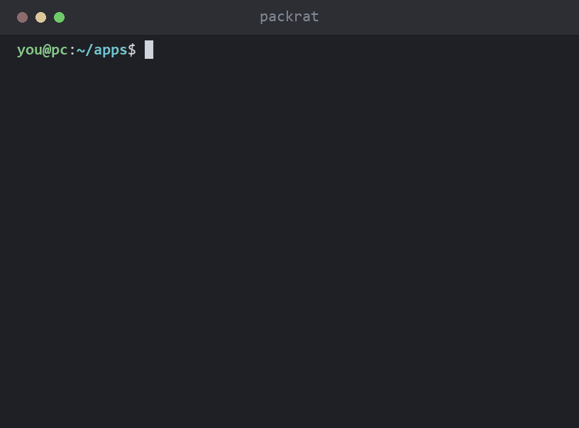
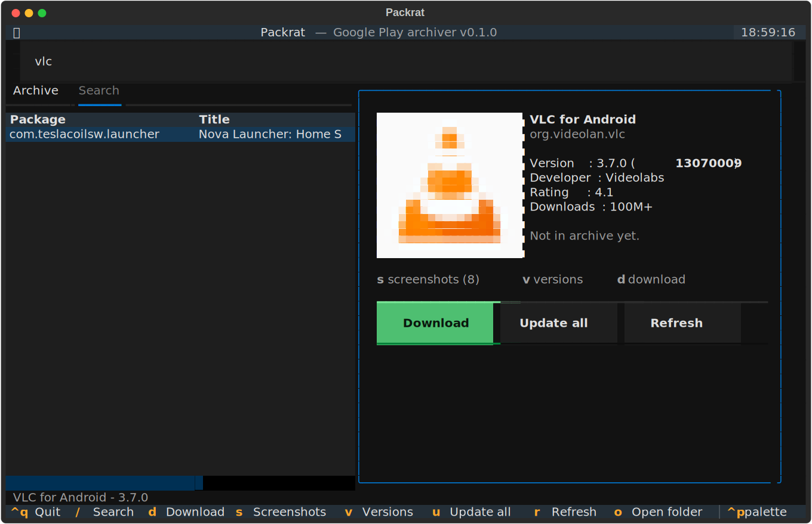
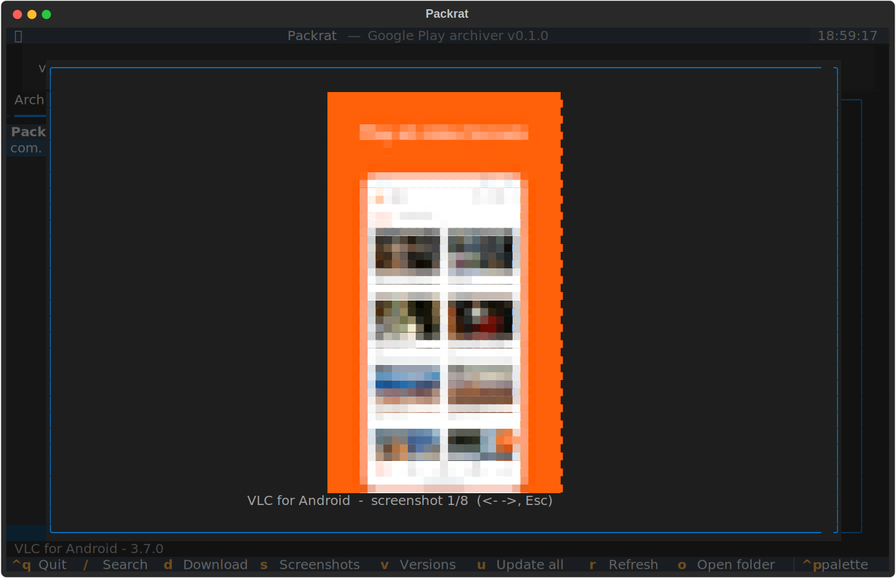
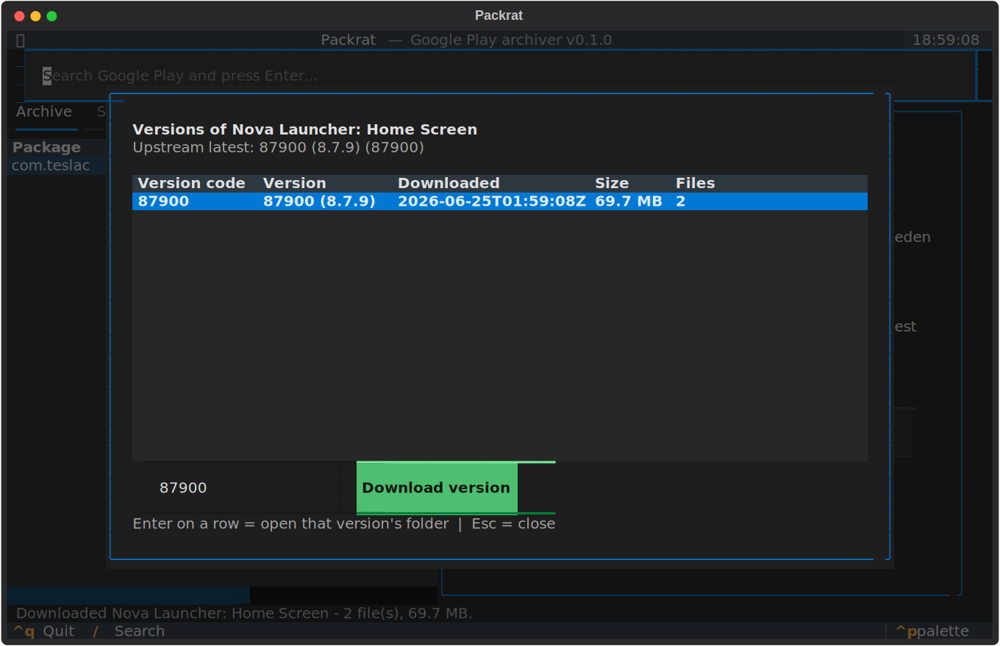

# Packrat

> Hoards free Android APKs from Google Play, so you don't have to.

<p align="center">
  
</p>

Download free Android APKs straight from Google Play to your PC and keep them in
a versioned local **archive**. Reasons you might want this:

* Grab apps **anonymously** — your own Google account never touches the request.
* Install apps on devices that lack Google Play (or aren't officially supported).
* Keep old versions so you can **roll back** when an update breaks something.
* Build a local cache to conserve bandwidth across the devices in your household.
* Inspect an app's details/version from your desktop without a phone in hand.

> Only **free** apps can be downloaded this way. Paid apps require a real,
> purchasing Google account and are not supported.

## Screenshots

The full-screen terminal UI — search, an archive browser, and an app's details
with its **icon and screenshots rendered right in the terminal**:

<p align="center">
  <br>
  <sub>Main view: archive list + app details with inline icon</sub>
</p>
<p align="center">
  <br>
  <sub>Screenshots viewer (press <code>s</code>)</sub>
</p>
<p align="center">
  <br>
  <sub>Version picker / rollback (press <code>v</code>)</sub>
</p>

## How it works

Packrat is a thin, friendly layer over the actively-maintained
[`gplaydl`](https://github.com/rehmatworks/gplaydl) library, which handles the
hard part — anonymous authentication (via Aurora's token dispenser, rotating
through real device profiles) and Google Play's protobuf protocol. Packrat adds:

* a **versioned on-disk archive** with a JSON index,
* a full-screen terminal UI, plus simple commands to search, inspect,
  download, list, and check for updates.

```
<archive>/
  packrat.json                      # index of everything you've downloaded
  apps/
    org.videolan.vlc/
      13070009/
        org.videolan.vlc-13070009.apk
```

## Requirements

* Python 3.9+

## Install

```bash
git clone https://github.com/sp00nznet/Packrat.git
cd Packrat
python -m venv .venv
# Windows:  .venv\Scripts\activate     |  Unix: source .venv/bin/activate
pip install -e .
```

This installs a `packrat` command (also runnable as `python -m packrat`).

Once it's published to PyPI you'll be able to skip the clone:

```bash
pip install packrat-apk   # the installed command is still `packrat`
```

## Usage

### Terminal UI (recommended)

```bash
packrat ui
```

A full-screen app with a search box, an archive browser and a live-updating
Search tab, an app-details pane (with the **icon rendered inline**), and a
download progress bar. If no archive exists at the target path it is created
for you.

| Key | Action |
| --- | --- |
| `/` | focus the search box |
| `d` | download the selected app |
| `s` | open the **screenshots** viewer (`←`/`→` to page, `Esc` to close) |
| `v` | open the **version picker** for the selected app |
| `u` | **update all** outdated apps in the archive |
| `r` | refresh the archive list |
| `o` | open the archive folder in your file manager |
| `Ctrl+Q` | quit |

**Version picker / rollback.** Press `v` to see every version of an app you've
archived. Select a row to open that version's folder (your roll-back copy), or
type a version code and download it. Note: Google only serves the *current*
version anonymously, so rolling back means keeping older versions **as you
download them over time** — Packrat never deletes an old version when it fetches
a new one.

**Update all.** Press `u` to check every archived app against Google Play and
download any that have a newer version, leaving the old ones in place.

### Command line

```bash
# Create an archive in the current directory
packrat init

# Search Google Play
packrat search "vlc"

# Show details for an app
packrat info org.videolan.vlc

# Download the latest version into the archive (with split APKs)
packrat get org.videolan.vlc

# Download a specific version code
packrat get org.videolan.vlc --version 13070009

# List what's in the archive
packrat list

# See which archived apps have a newer version upstream
packrat outdated
```

Useful flags: `--archive/-A <path>` to point at a specific archive,
`--arch arm64|armv7`, `--no-splits`, `--no-extras`, and `--force` to
re-download something already archived.

Split APKs (when present) install to a device with:

```bash
adb install-multiple *.apk
```

## Known limitations

* Free apps only (see above).
* `search` results depend on `gplaydl`'s protobuf parsing and can occasionally
  return noisy entries for some queries; `info`/`get` by exact package name are
  reliable.
* Authentication is anonymous and best-effort — Google can change things at any
  time. Keeping `gplaydl` updated (`pip install -U gplaydl`) is the fix when the
  protocol shifts.

## Inspiration

Packrat is its own project, written from scratch in Python. The *idea* — a
personal desktop tool that downloads and archives Google Play APKs — was
inspired by the long-defunct Java app [Raccoon](https://github.com/onyxbits/Raccoon),
which stopped working years ago when Google retired its old auth. Packrat shares
none of that code; it keeps the spirit and delegates the moving-target Play
protocol to the maintained [`gplaydl`](https://github.com/rehmatworks/gplaydl)
library.

## License

Apache License 2.0 — see [LICENSE](LICENSE).
